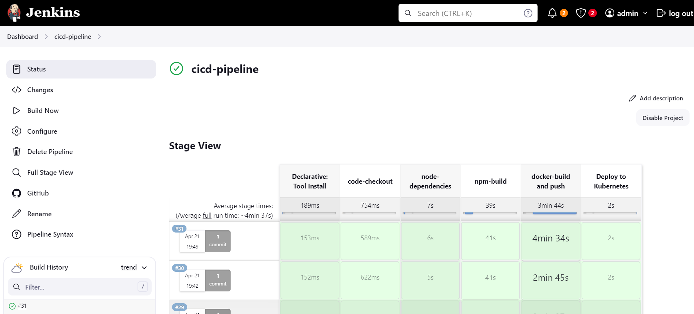

# Assignment-APIwiz

# 1.Linux
 1. Provide steps to create a directory inside a directory where the parent directory does not exist
    ```
    mkdir -p /path/to/parent/directory/child_directory
    
    ```
    

 3. How to install a package on a Linux server when there is no internet connection?
    - Download the package (.deb or .rpm) and any dependencies on a machine with internet access
    - Transfer the files to the server
      

   ```
   sudo dpkg -i package_name.deb  # For Debian-based systems 
   sudo yum install package_name.rpm  # For RedHat-based systems
   ```
      
  3. How to access specific folders of Server A from Server B and Server C?

     You can access specific folders of Server A from Server B and Server C using SSH (Secure Shell) and SCP (Secure Copy). First, ensure that SSH is enabled on Server A. Then, from
     Server B or Server C, you can use SCP to copy files or folders from Server A to Server B or Server C.
   
   ```
   scp username@serverA:/path/to/folder/file.txt /local/path

   ```
       
  This command copies the file file.txt from Server A to the local path on Server B or Server C.

  4. How to check all the running processes from a server?
    
  ```
 ps aux
  ```   
  5. Provide the command to delete all the files older than X days inside a specific directory?

  ```
  find /path/to/directory -type f -mtime +30 -delete
  ```
  6. Create a shell script to identify the process ID a. script should as a user input for process ID b. If the process exists, the script should print the process ID and exit c. If the          process doesn't exist script should print the process doesn't exist and asks for another input

  ```
  #!/bin/bash

read -p "Enter process ID: " pid

if ps -p $pid > /dev/null; then
    echo "Process $pid exists."
else
    echo "Process $pid does not exist."
fi
```


# 2.Docker
1. What is Docker and Why Do We Need It?

    Docker is a platform that enables developers to package applications with all their dependencies into standardized units called containers.
    These containers are lightweight, portable, and self-contained, meaning they include everything needed to run the application regardless of the underlying operating system.
    Docker helps improve development productivity, simplify application deployment, and enhance scalability and reliability.

2. Write a Dockerfile for a sample Java/Python application

   ```dockerfile
   FROM openjdk:11-jdk
   WORKDIR /app
   COPY target/my-java-app.jar /app
   CMD ["java", "-jar", "my-java-app.jar"]
   ```
3. What is the Docker lifecycle?

   Build: You create a Dockerfile that defines the instructions for building the container image. You run docker build to execute these instructions and create the image.
   Run: You create a container instance from an image using docker run. This creates a running instance of the application.
   Stop: You can stop a running container using docker stop. This stops the container process but keeps the container intact.
   Remove: You can remove a stopped container using docker rm. This removes the container entirely.

4. Difference Between Images and Containers

   Docker Image: An image is a read-only template that contains the application code, libraries, dependencies, and configuration files needed to run the application. It's like a blueprint.
   
   Docker Container: A container is a running instance of an image. It's like a physical application created from the image's blueprint. You can have multiple containers running from the same image.

5. How to check docker container logs? Provide the command for the same

   ```
   docker logs <container_name_or_id>
   ```
# 3.Kubernetes
1. What are different types of services?

   In Kubernetes, there are different types of services to expose applications running in the cluster to external clients or to allow communication between different applications within    the cluster. Some of the commonly used types of services include:

   ClusterIP: Exposes the service on a cluster-internal IP address. This type of service is only accessible within the cluster.

   NodePort: Exposes the service on each node's IP at a static port. This type of service allows external access to the service by accessing the node's IP address and the NodePort.

   LoadBalancer: Exposes the service externally using a cloud provider's load balancer. This type of service is typically used in cloud environments to provide external access to the    service.

   ExternalName: Maps the service to the contents of the externalName field (e.g., a DNS name). This type of service is used to provide a way to access services outside the cluster.

2. What is a pod?

   Pod is the smallest deployable unit. It represents a co-located group of one or more containers with shared storage and a network identity. Pods typically have a short lifespan (they're ephemeral) and are managed by a Kubernetes controller (e.g., Deployment or ReplicaSet) that ensures a desired number of replicas are running at all times.
   
4. Create a pod with the above created custom image when a pod dies k8s should automatically restart
   
    To create a pod with the custom image you built and have Kubernetes automatically restart it on failure, you can use a Deployment resource. Here's an example YAML manifest:
    ```yml
            apiVersion: apps/v1
            kind: Deployment
            metadata:
              name: my-app-deployment
            spec:
              replicas: 3
              selector:
                matchLabels:
                  app: my-app
              template:
                metadata:
                  labels:
                    app: my-app
                spec:
                  containers:
                  - name: my-app-container
                    image: your-custom-image:tag
    ```


6. How to access the custom application with a specific port?
   
   To access your custom application running in a pod with a specific port, you can expose the application using a Service resource. Here's an example YAML definition for a Service of type    NodePort:

   ```yml
   apiVersion: v1
      kind: Service
      metadata:
        name: my-app-service
      spec:
        type: NodePort
        ports:
        - port: 8080
          targetPort: 8080
          nodePort: 30000   # Specify the desired NodePort
        selector:
          app: my-app
    ```


# 4.CI/CD
1. Set up a pipeline (Github actions/Gitlab runner/ Jenkins or any open source tool) to build, test, create a docker image, publish and deploy to k8s. Use the application present in this public repo https://github.com/apiwizlabs/wizdesk. 2. Automate to spin up a network and virtual machines. Install the Nginx package and start the service(any cloud) 

## Jenkins Pipeline for Building, Testing, Dockerizing, Publishing, and Deploying to Kubernetes:


### Objectives:

Set up an automated pipeline in Jenkins to:

Checkout code from a public GitHub repository (https://github.com/paletiavinash/wizdesk).

Optionally perform build and testing steps specific to the application.

Build a Docker image for the application.

Optionally push the image to a Docker registry.

Deploy the application to a Kubernetes cluster.

### Prerequisites:

Jenkins server accessible.

Kubernetes cluster configured.

Docker installed and configured on Jenkins server (if building image on Jenkins).

Git plugin installed on Jenkins.

Kubernetes plugin installed on Jenkins.

Access credentials configured in Jenkins for:

GitHub repository

Kubernetes cluster (if pushing Docker image)


```groovy
pipeline {
    agent any

    tools {
        nodejs 'node20'
    }
   
    environment {
        PATH = "/home/ubuntu/bin:$PATH"
    }

    stages {
        stage('code-checkout') {
            steps {
                git branch: 'main', url: 'https://github.com/paletiavinash/wizdesk'
            }
        }
        stage('node-dependencies') {
            steps {
                sh "npm install"
            }
        }
        stage('npm-build') {
            steps {
                script {
                    sh 'CI="" npm run build'
                }
            }
        }
        stage('docker-build and push') {
            steps {
                script {
                    withDockerRegistry(credentialsId: 'docker', toolName: 'docker') {
                        sh 'docker build -t yuviavinash/wizdesk:v1 .'
                        sh 'docker push yuviavinash/wizdesk:v1'
                    }
                }
            }
        }
        stage('Deploy to Kubernetes') {
            steps {
                script {
                    withKubeConfig(
                        caCertificate: '',
                        clusterName: '',
                        contextName: '',
                        credentialsId: 'k8s',
                        namespace: '',
                        restrictKubeConfigAccess: false,
                        serverUrl: ''
                    ) {
                        sh 'kubectl apply -f wiz-deploy.yaml'
                        sh 'kubectl apply -f wiz-svc.yaml'
                    }
                }
            }
        }
    }
}
```
<div align="center">
  

  <br>
  <a href="http://netflix-clone-with-tmdb-using-react-mui.vercel.app/">
    
  </a>
</div>

## Automation of Spinning up Network and Virtual Machines on AWS and Installing Nginx

Spin up Network and Virtual Machines:

Use Terraform to define the AWS infrastructure (VPC, subnets, security groups, etc.) and EC2 instances.

Write Terraform scripts (*.tf files) to describe the desired infrastructure configuration.

Use the terraform CLI or Terraform plugins in Jenkins to apply these scripts and provision the infrastructure.

Github repo https://github.com/paletiavinash/4.2/
  

``` main.tf
terraform {
  required_version = ">= 0.14"

  required_providers {
    aws = {
      source  = "hashicorp/aws"
      version = "~> 4.0"
    }
  }
}

provider "aws" {
  region = "ap-south-1"
}

resource "aws_vpc" "my_vpc" {
  cidr_block = "10.0.0.0/16"
  enable_dns_support = true
  enable_dns_hostnames = true
}

resource "aws_internet_gateway" "my_igw" {
  vpc_id = aws_vpc.my_vpc.id
}

resource "aws_subnet" "my_subnet" {
  vpc_id     = aws_vpc.my_vpc.id
  cidr_block = "10.0.1.0/24"
  availability_zone = "ap-south-1a"
  map_public_ip_on_launch = true
}

resource "aws_route_table" "my_route_table" {
  vpc_id = aws_vpc.my_vpc.id

  route {
    cidr_block = "0.0.0.0/0"
    gateway_id = aws_internet_gateway.my_igw.id
  }
}

resource "aws_route_table_association" "subnet_association" {
  subnet_id      = aws_subnet.my_subnet.id
  route_table_id = aws_route_table.my_route_table.id
}

resource "aws_security_group" "nginx_sg" {
  vpc_id = aws_vpc.my_vpc.id

  ingress {
    from_port   = 80
    to_port     = 80
    protocol    = "tcp"
    cidr_blocks = ["0.0.0.0/0"]
  }

  egress {
    from_port   = 0
    to_port     = 0
    protocol    = "-1"
    cidr_blocks = ["0.0.0.0/0"]
  }
}

resource "aws_instance" "my_ec2_instance" {
  ami           = "ami-001843b876406202a"
  instance_type = "t2.micro"
  subnet_id     = aws_subnet.my_subnet.id
  security_groups = ["aws_security_group.web_server.id"]

  tags = {
    Name = "MyEC2Instance"
  }

  user_data = <<-EOF
              #!/bin/bash
              yum update -y
              yum install nginx -y
              systemctl start nginx
              systemctl enable nginx
              EOF
}
```
